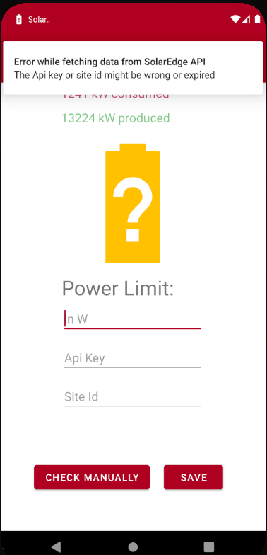
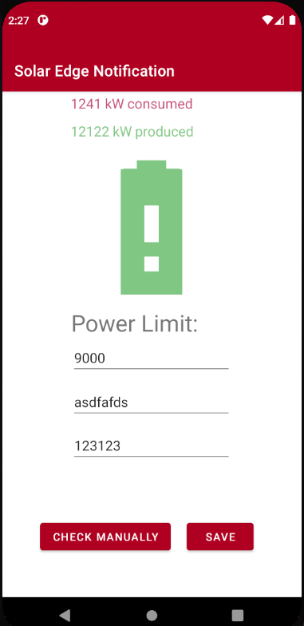
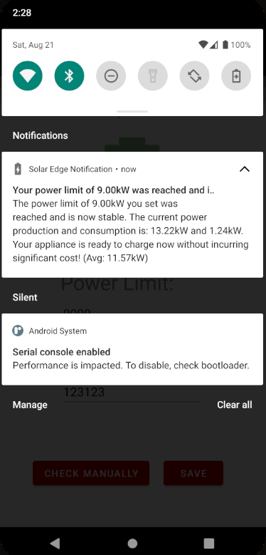
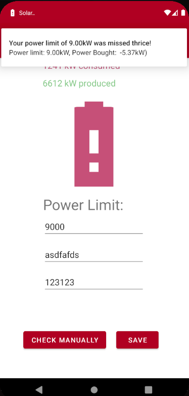

# Android-solarpower-notification

I coded this app to make charging the electric vehicle easier. The app sends you a notification as soon as your solar panels produce enough power to charge the car and sends you another one if the power produced drops below. The information about the panels is retrieved from the manufacturers(SolarEdge) api.

### Usage
The screen you are presented with when opening the app for the first time might look similar to this:

Enter the power necessary to charge your vehicle in the first field, the `API key` in the second and the `Site Id(A special number to identify your panels)` in the third panel. Then press save.

The app will now query the API every `15 min` and check the power. The two text fields up top will be updated and the giant battery image will be either green, if enough power is accessible or red if not.

If something went wrong or you have the wrong API keys the app will send you a notification informing you of that and set the image to a yellow battery.

If everything went well and you have enough power this screen and the following notification will appear.

If you do not have enough energy this screen and the following notification will greet you:

